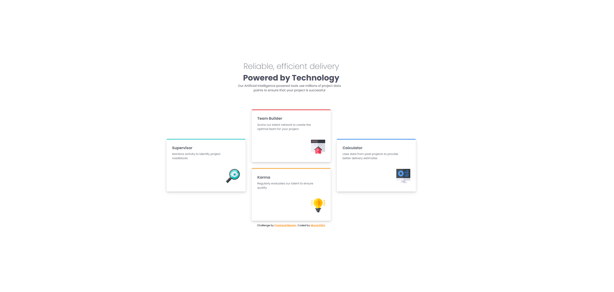
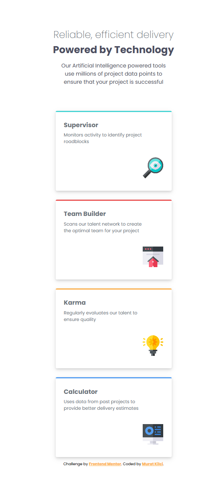

# Four Card Feature Section Master

This project is a solution to the [Frontend Mentor - Four Card Feature Section](https://www.frontendmentor.io/challenges/four-card-feature-section-weK1eFYK) challenge. The goal is to build a responsive feature section using clean HTML and CSS, showcasing four key features in a modern, grid-based layout.

## 📷 Screenshots

| Desktop View | Mobile View |
|--------------|-------------|
|  |  |

---

## 🚀 Live Demo

👉 [Live site URL here](https://muratkilci067.github.io/Four-card-feature-section-master/)

## 🛠 Built With

- HTML5
- CSS3 (Flexbox & Grid)
- Mobile-first design principles

## 📱 Responsive Design

This project is fully responsive and works seamlessly on a wide range of devices, from mobile phones to desktops.

## 💡 What I Learned

- How to structure a feature grid layout using CSS Grid and Flexbox
- Implementing clean, scalable UI designs from a design mockup
- Enhancing visual hierarchy with spacing, color, and typography

## 🤝 Contributing

Contributions are welcome! To contribute:

1. Fork the repository
2. Create a new branch (`git checkout -b feature-name`)
3. Commit your changes (`git commit -m 'Add feature'`)
4. Push to the branch (`git push origin feature-name`)
5. Open a Pull Request

## Author

- Frontend Mentor - [@yourusername](https://www.frontendmentor.io/profile/muratkilci067)
- GitHub - [@yourgithub](https://github.com/muratkilci067)

## 🙌 Acknowledgments

Thanks to [Frontend Mentor](https://www.frontendmentor.io) for this awesome challenge!